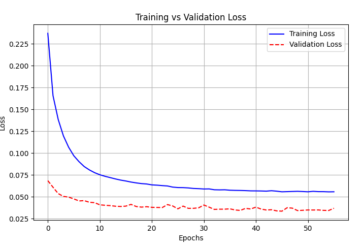

# Maya Deformer Playground

This repository explores different approaches to Maya deformations, focusing on frameworks and pipelines rather than the deformer algorithms themselves. The goal is to showcase an end-to-end machine learning pipeline and traditional C++ deformer implementations.

## Project Structure

### cppDeformer
A basic inflate deformer that pushes vertices along their normals.

### onnxDeformer
Exploring a machine learning approach to deformation using ONNX.

Here, we simulate a typical ML team setup:
- 🧑‍🔬 Data Scientist – Collects and preprocesses deformation data. [python/data_collection.py](python/data_collection.py)
- 🏗️ MLOps/ML Engineer – Trains and optimizes the deformation model. [python/train_model.py](python/train_model.py)
- 🚀 Inference Application – Uses the trained model for real-time deformation in Maya. [onnxDeformer/onnxDeformer.cpp](onnxDeformer/onnxDeformer.cpp)

##### Why This Project?
- Demonstrates ML integration into DCC tools like Maya.
- Showcases MLOps best practices for model training and deployment.
- Provides a foundation for experimenting with data-driven deformations.
